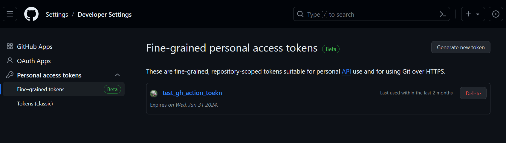
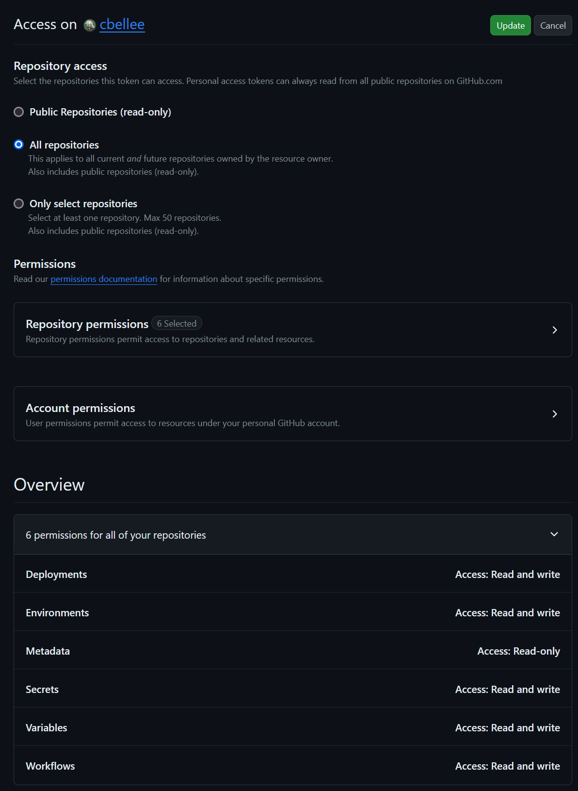

# GitHub action to deploy an azure function using identity federation

## Prerequisites

- GitHub account
- Azure subscription
- Azure PowerShell module

## Setup

1. create a new GitHub repository
2. clone this repo to your local machine
  
3. set the local repo's remote to the new GitHub repo
    - `$ git remote add origin <HTTPS or SSH path from previous step>`
4. push the repo to GitHub
    - `$ git push -u origin main`
6. get GitHub repoID by running the query below using the GitHub graphql explorer at this url `https://docs.github.com/en/graphql/overview/explorer`

    ```graphql
    query {
        repository (name: "gh-action-demo-function", owner: "<your GitHub owner/username>")  {
              databaseId
        }
    }
    ```


7. save the repoID for use later
8. create GitHub access token

    

    - go to your GitHub profile settings
    - select Developer settings
    - select Personal access tokens
    - select Generate new token
    - give the token a name
    - select 'All repositories' for the repo scope
    - select the following scopes
        - deployments:read/write
        - environments:read/write
        - metadata:read
        - secrets:read/write
        - variables:read/write
        - workflows:read/write

    

9. add environment variables to GitHub repo
  - `PS C:\> ./scripts/env_vars.ps1 -RepoId <GitHub RepoId> -Token <GitHib Access Token>`
10. federate GitHub and Azure AD 
  - `PS C:\> ./scripts/federated-identity.ps1 -orgName <Git Organization name> -repoName <Git repo name>`
11. add changes to repo, commit and push to execute the GitHub Action pipeline
  - `$ git add .`
  - `$ git commit -m "initial commit"`
  - `$ git push`
